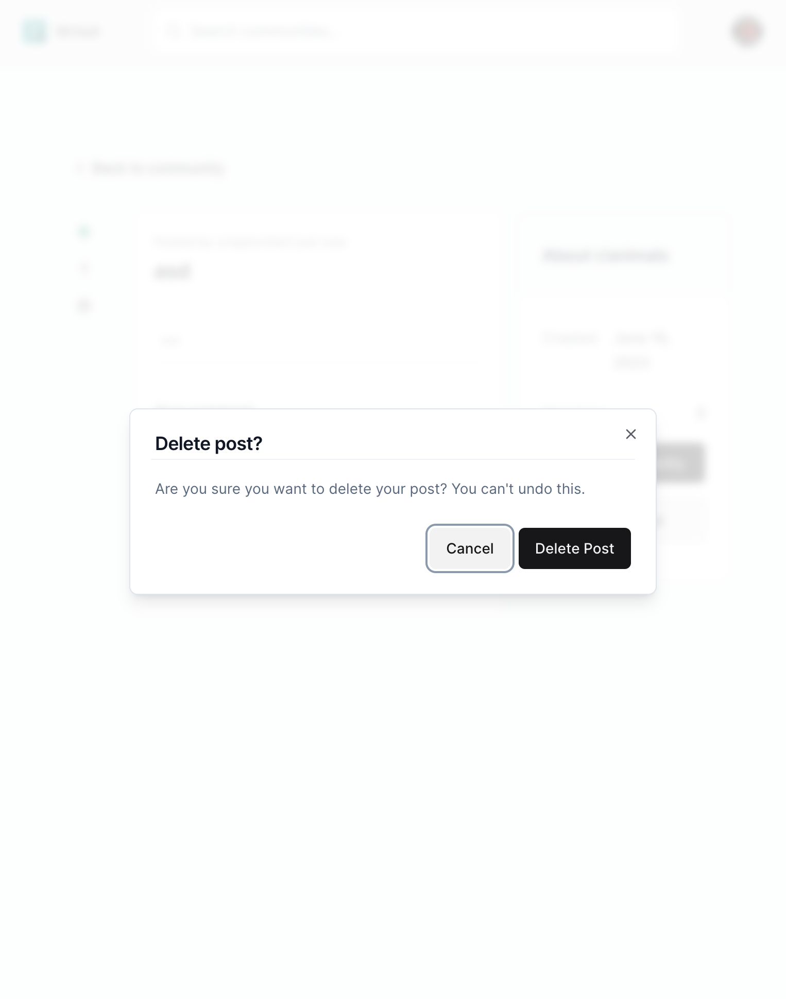

# Writeit

[Live App](https://open-ai-chat-bot-nine.vercel.app/)

## Introduction
Writeit is a Reddit-inspired social media platform with a forum-style discussion structure; allowing users to
register/sign-in, create their own communities, and publish posts of their own

## Tech
Next.js, React, TypeScript, Tailwind CSS, Prisma

## Features
<ul>
  <li>Secured auth with OAuth protocol, using NextAuth with Google</li>
  <li>Custom feed for authenticated users</li>
  <li>Optimistic updates for better UX</li>
  <li>Infinite scrolling for dynamic posts loading</li>
  <li>Image uploads and link previews</li>
  <li>Full comment functionality with nested replies</li> 
</ul>

## Screenshots

